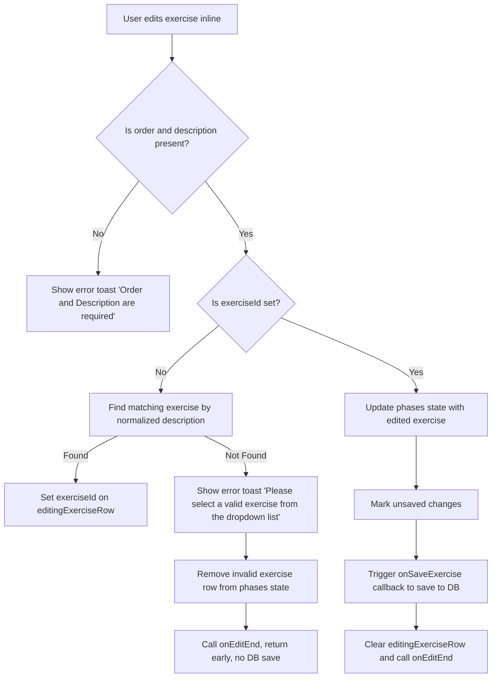

# Plan to Improve Invalid Exercise Detection and Handling

## Overview

The `saveInlineExercise` function currently handles two outcomes:

1. If the exercise is invalid (no matching exercise found), it should:
    - Show an error toast
    - Remove the invalid exercise row from the UI
    - Prevent any database save
2. If the exercise is valid, it should:
    - Update the phases state with the edited exercise
    - Mark unsaved changes
    - Trigger a database save via `onSaveExercise`
    - Clear editing state

## Current Issue

The invalid exercise logic is not working as expected. Possible causes include:

-   Exact matching of exercise description causing false negatives
-   UI state not updating correctly to remove invalid rows
-   Database save triggered incorrectly

## Proposed Improvements

### 1. Normalize Description Matching

-   Trim whitespace and convert both the `editingExerciseRow.description` and `exercises.exerciseName` to lowercase before matching.
-   This reduces false negatives due to casing or extra spaces.

### 2. Add Debug Logging

-   Log the description being matched and the list of exercise names.
-   Log whether a matching exercise was found or not.
-   Helps diagnose matching issues.

### 3. Verify State Update and UI Reset

-   Ensure `updatePhases` correctly removes the invalid exercise row.
-   Ensure `onEditEnd` resets editing state and UI properly.

### 4. Add Tests

-   Unit or integration tests for `saveInlineExercise`.
-   Test cases for valid and invalid exercises.
-   Confirm invalid exercises do not trigger DB save and are removed.
-   Confirm valid exercises trigger DB save.

### 5. Optional UX Improvements

-   Highlight invalid row before removal.
-   Provide more detailed error messages if needed.

## Flow Diagram

---

Please confirm if you would like me to proceed with writing the code changes based on this plan.
