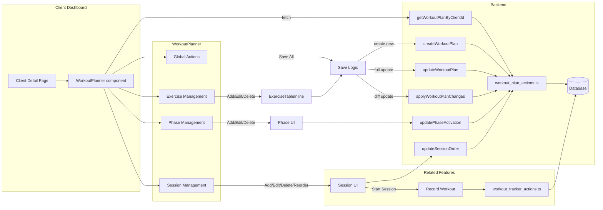

# Workout Planner Component

## Overview

The `WorkoutPlanner` React component renders, edits, and saves a client's workout plan. It provides phase/session/exercise CRUD, drag-and-drop reordering, inline editing, and a "Save All" action. Built with React, Next.js, Tailwind CSS, and Drizzle/Appwrite actions, it integrates into the protected client dashboard.

## Data Source & Props

-   **Props**

    -   `client_id: string` – the client identifier
    -   `exercises: SelectExercise[]` – available exercise definitions from the database

-   **Fetch**
    -   On mount, calls `getWorkoutPlanByClientId(client_id)` (in `workout_plan_actions.ts`)
    -   Maps backend response (`WorkoutPlanResponse`) into local `Phase[]` state
    -   Handles empty responses by initializing with empty phases array

## State Management

-   **Core Data**
    -   `phases: Phase[]` – hierarchical plan (phases → sessions → exercises)
    -   `planId`, `lastKnownUpdatedAt` – for concurrency control
    -   `hasUnsavedChanges`, `isSaving`, `isLoading` – UI flags
    -   `changeTracker: WorkoutPlanChangeTracker` – diff tracking for efficient updates

-   **UI State**
    -   `showConfirm` – delete-confirmation dialog state
    -   `editingPhase`, `editingSession`, `editingExercise` – inline edit tracking
    -   `editPhaseValue`, `editSessionValue` – temporary edit values
    -   `startingSessionId` – tracks session being started
    -   `conflictError` – tracks concurrent edit conflicts
    -   `savePerformed` – counter to trigger refetches after saves

-   **Change Tracking**
    -   Uses `WorkoutPlanChangeTracker` class to efficiently track:
        -   Created phases, sessions, and exercises
        -   Updated phases, sessions, and exercises
        -   Deleted phases, sessions, and exercises
    -   Enables sending only changed data to the server

## Data Structure

```typescript
// Hierarchical data structure
interface Phase {
    id: string;
    name: string;
    isActive: boolean;
    isExpanded: boolean;
    sessions: Session[];
}

interface Session {
    id: string;
    name: string;
    duration: number | null;
    isExpanded: boolean;
    exercises: Exercise[];
}

interface Exercise {
    id: string;
    order: string;
    motion: string | null;
    targetArea: string | null;
    exerciseId: string | null;
    description: string | null;
    duration?: number;
    sets?: string;
    reps?: string;
    tut?: string;
    tempo?: string;
    rest?: string;
    additionalInfo?: string;
    setsMin?: string;
    setsMax?: string;
    repsMin?: string;
    repsMax?: string;
    restMin?: string;
    restMax?: string;
}
```

## User Interactions

-   **Phase Management**
    -   **Add Phase**: "+ Add Phase" button creates a new phase with a UUID
    -   **Toggle Expansion**: Chevron icons expand/collapse phases
    -   **Rename Phase**: Click Edit icon → input field → Save button
    -   **Activate/Deactivate**: Switch control with optimistic UI update
    -   **Delete Phase**: Trash icon with confirmation dialog
    -   **Duplicate Phase**: Copy icon creates a clone with new IDs

-   **Session Management**
    -   **Add Session**: "+" button per phase creates a new session
    -   **Rename Session**: Click Edit icon → input field → Save button
    -   **Delete Session**: Trash icon with confirmation dialog
    -   **Duplicate Session**: Copy icon creates a clone with new IDs
    -   **Drag & Drop**: Reorder sessions via `react-dnd` (`DraggableSession`)
    -   **Start Session**: Button routes to `/record-workout?sessionId=…`

-   **Exercise Management**
    -   **Add Exercise**: "+" per session creates a new exercise with defaults
    -   **Edit Exercise**: Handled by `ExerciseTableInline` component
    -   **Delete Exercise**: Handled within exercise table
    -   **Exercise Selection**: Dropdown to select from available exercises

-   **Global Actions**
    -   **Save All**: Button triggers `saveAll()` function
    -   **Conflict Resolution**: Detects and handles concurrent edit conflicts

## Data Persistence & Actions

-   **Read Operations**
    -   `getWorkoutPlanByClientId(client_id)` - Fetches plan data on component mount

-   **Write Operations**
    -   **Create New Plan**: `createWorkoutPlan(client_id, { phases })` - When no plan exists
    -   **Full Update**: `updateWorkoutPlan(planId, lastKnownUpdatedAt, { phases })` - Fallback when change tracking unavailable
    -   **Partial Update**: `applyWorkoutPlanChanges(planId, lastKnownUpdatedAt, changes)` - Optimized update with only changed data
    -   **Phase Toggle**: `updatePhaseActivation(phaseId, isActive, lastKnownUpdatedAt)` - Dedicated action for phase activation
    -   **Reorder Sessions**: `updateSessionOrder(phaseId, orderedIds, lastKnownUpdatedAt)` - Updates session order after drag-and-drop

-   **Concurrency Control**
    -   Uses `lastKnownUpdatedAt` timestamp to detect conflicts
    -   Handles conflicts by refetching latest data and showing error message
    -   Prevents data loss from simultaneous edits

-   **Optimistic Updates**
    -   UI updates immediately before server confirmation
    -   Reverts changes if server returns error
    -   Improves perceived performance

## Component Architecture

-   **Main Component**: `WorkoutPlanner` - Container for the entire feature
-   **Sub-components**:
    -   `DraggableSession` - Handles drag-and-drop functionality
    -   `ExerciseTableInline` - Manages exercise display and editing
    -   UI primitives from `components/ui/*`

-   **Utility Classes**:
    -   `WorkoutPlanChangeTracker` - Tracks changes for efficient updates

## Error Handling

-   **Loading States**: Shows spinner during data fetching
-   **Empty States**: Displays message when no phases exist
-   **Conflict Resolution**: Detects and handles concurrent edit conflicts
-   **Toast Notifications**: Uses `sonner` for success/error feedback
-   **Console Logging**: Detailed logs for debugging

## Styling

-   **Framework**: Tailwind CSS for utility-based styling
-   **UI Components**: 
    -   `Button`, `Card`, `CardContent`, `Dialog`, `Input`, `Label`, `Switch`, `Tooltip` from `components/ui/*`
    -   Custom styling with Tailwind classes (`w-full`, `max-w-6xl`, `bg-card`, `p-4`, `rounded-lg`, etc.)
-   **Icons**: `lucide-react` for consistent iconography
-   **Responsive Design**: Adapts to different screen sizes
-   **Visual Feedback**: Loading spinners, hover states, active indicators

## Future Improvements

-   **Undo/Redo**: A future version (`WorkoutPlanner.tsx` in `workout-planner-future` directory) implements history tracking
-   **Performance Optimization**: Further optimizations for large workout plans
-   **Enhanced Validation**: More robust input validation
-   **Offline Support**: Potential for offline editing and syncing

## Component Flow



## Integration Points

-   **Parent Component**: Embedded in client dashboard
-   **Database**: Interacts with Drizzle ORM schemas via server actions
-   **Authentication**: Protected routes ensure only authorized access
-   **Related Features**: 
    -   Links to workout recording functionality
    -   Uses shared exercise definitions

## Technical Implementation Details

-   **Framework**: React with Next.js (App Router)
-   **State Management**: React useState/useEffect hooks
-   **Server Actions**: Next.js server actions for data operations
-   **Database Access**: Drizzle ORM with Appwrite backend
-   **Drag and Drop**: react-dnd library
-   **Unique IDs**: UUID generation for new entities
-   **Optimistic Updates**: UI updates before server confirmation
-   **Concurrency Control**: Timestamp-based conflict detection